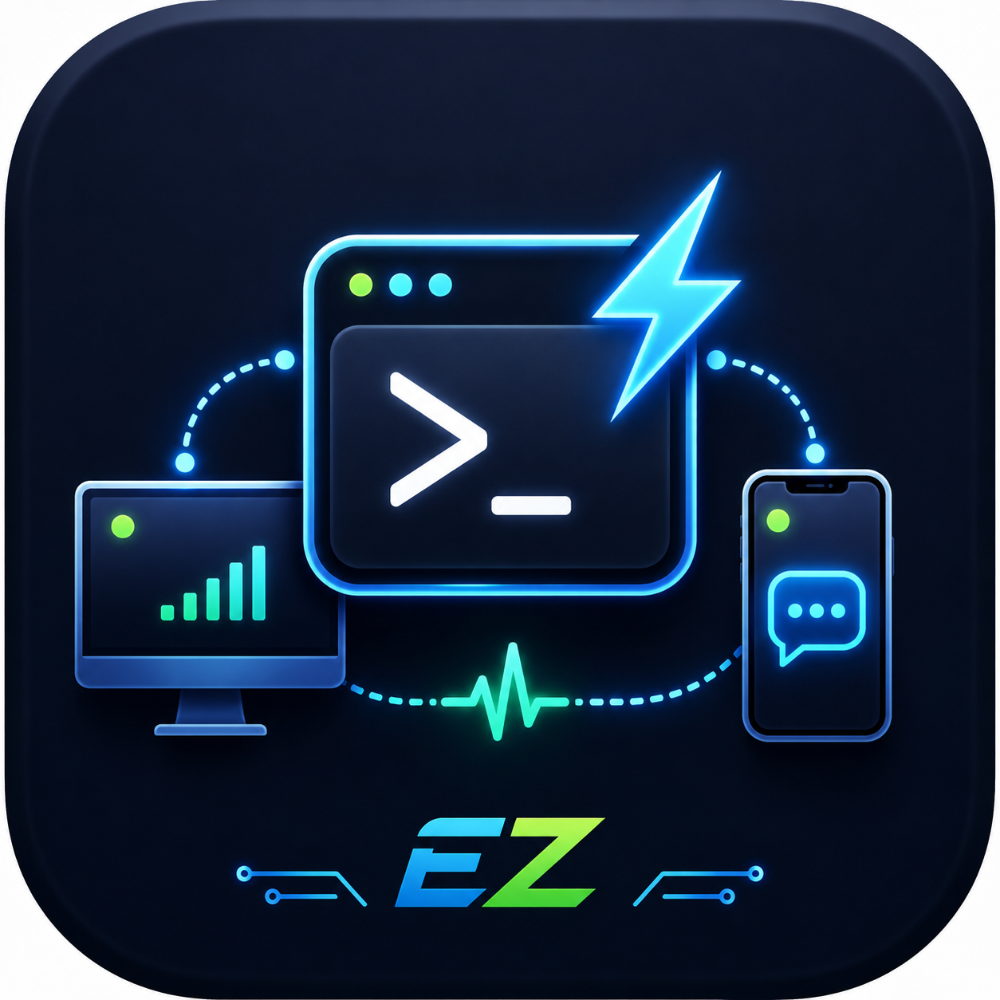
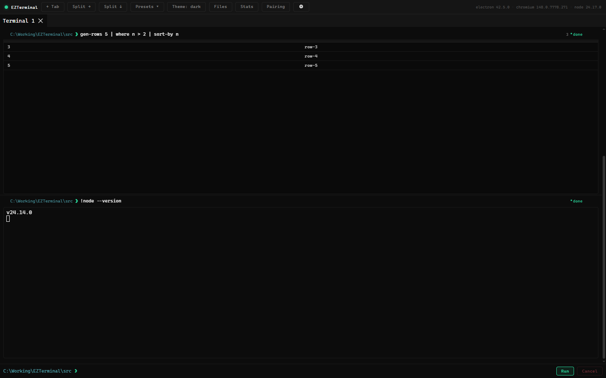
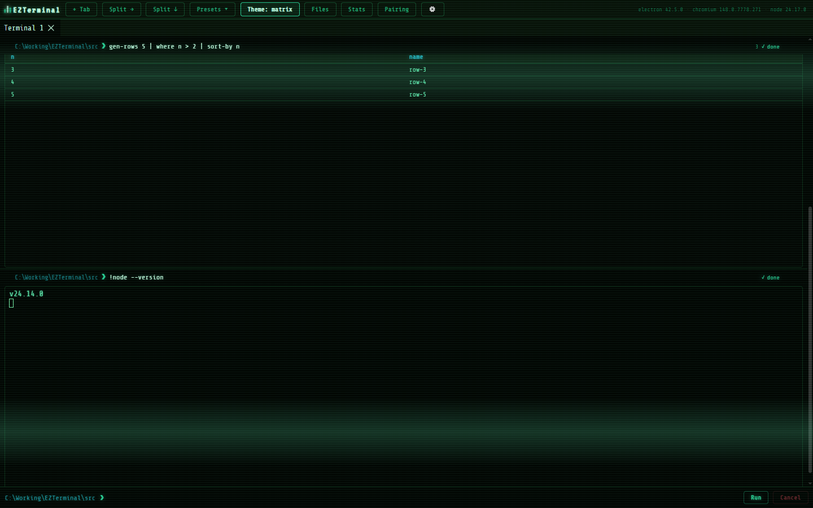
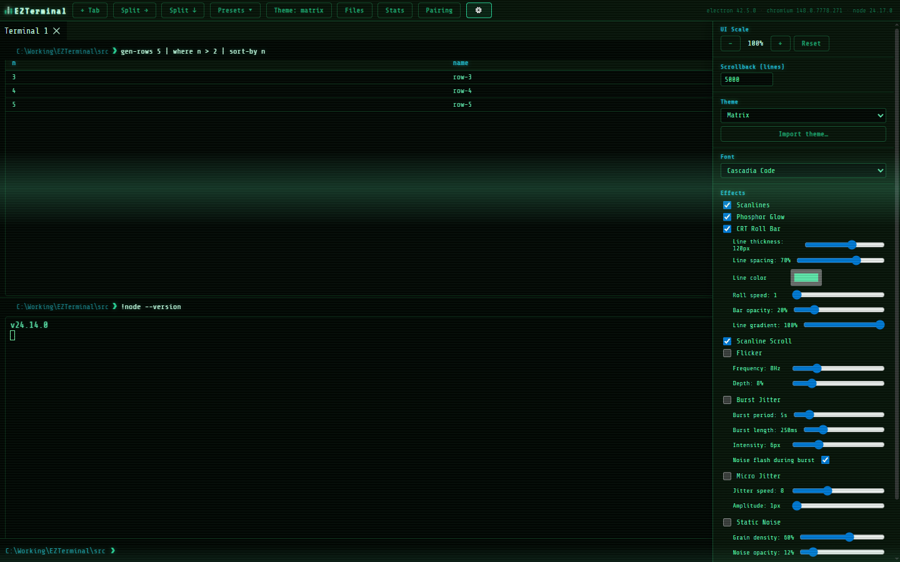
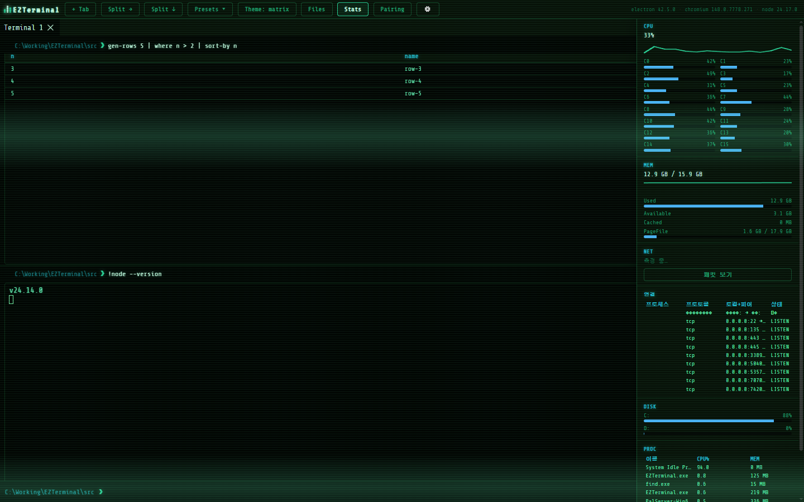
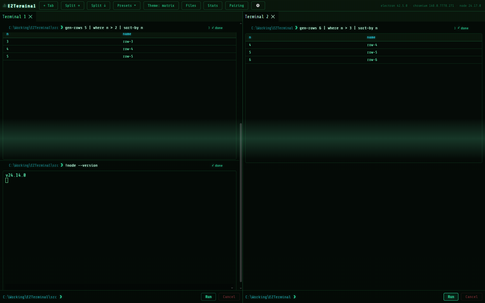

<div align="center">



# EZTerminal

**A structured-data shell terminal for Windows — pipe typed tables, not text.**

Block-based UI · themes &amp; CRT effects · system monitor · SSH · pair your phone as a remote




</div>

---

## What is EZTerminal?

EZTerminal is a desktop terminal that treats command output as **structured data** instead of flat
text. Built-ins like `ls`, `gen-rows`, `ps` and `history` emit **typed rows** you can filter and sort
with real pipelines:

```
gen-rows 5 | where n > 2 | sort-by n
ls | where size > 1000 | sort-by size
```

Results render as a live, **virtualized table** (100,000+ rows stay smooth). Every command is a
collapsible **block** with its own status, working directory and output — and external / TUI programs
(`node`, `git`, `claude`, `codex`, …) are auto-detected and run in a full PTY.

It also ships a companion **Android app** that pairs with the desktop over your LAN / Tailscale to run
and mirror sessions from your phone.

## Features

### 🧩 Structured-data shell
- Typed pipelines — `where`, `sort-by`, `gen-rows` over real columns, not text
- Virtualized tables (100k+ rows) and variables (`let threshold = 2`)
- Block UI: per-command status, cwd, collapse / dismiss
- Adaptive rendering: plain text vs full PTY / xterm, auto-detected

### 🎨 Themes &amp; CRT effects
Light, Dark and a **Matrix CRT** theme, plus importable custom theme mods. Toggle scanlines, phosphor
glow, a moving CRT roll bar, flicker, jitter and noise — each with live sliders — and pick any bundled
monospace font.

<table>
<tr>
<td width="50%"></td>
<td width="50%"></td>
</tr>
</table>

### 📊 System monitor
A btop-style panel: per-core CPU, memory breakdown, network, disk, live connections and a process
list — plus optional live **packet capture** (Npcap).



### 🪟 Tabs, splits &amp; layouts
An independent shell session per tab, drag-to-rearrange splits, savable presets and layout persistence
across restarts. Windows Terminal-parity keys: copy / paste, context menus, configurable scrollback,
and a `Ctrl+C` that stops the foreground program without killing the whole tree.



### 📁 Files &amp; 🔐 SSH
A built-in file explorer (desktop and mobile) and an SSH client with trust-on-first-use host-key
verification.

### 📱 Mobile remote control
Pair the Android app to run and mirror desktop sessions from your phone.
**Off by default, token-gated and origin-checked** — see [SECURITY.md](SECURITY.md).

## Download

Grab the latest **Windows installer** from the
[**Releases**](https://github.com/dlwlgus9125/EZTerminal/releases/latest) page →
`EZTerminal-Setup.exe`.

> Builds are currently **unsigned**, so Windows SmartScreen may warn about an "unknown publisher" on
> first run. Choose *More info → Run anyway* to proceed.

## Build from source

```bash
pnpm install
pnpm start        # run in development
pnpm make         # build the Windows installer -> out/make/squirrel.windows/x64/
pnpm test         # unit tests (Vitest)
pnpm e2e          # end-to-end tests (Playwright + Electron)
```

The Android companion app lives in [`mobile/`](mobile/) (Capacitor + Android Studio).

## Tech stack

Electron · React · TypeScript · xterm.js · node-pty (ConPTY) · Capacitor (Android) · Vite · Playwright

## Security

Remote control is opt-in and token-gated. See **[SECURITY.md](SECURITY.md)** for the remote-bridge
threat model and how to report a vulnerability.

## License

[MIT](LICENSE) © 2026 dlwlgus9125
