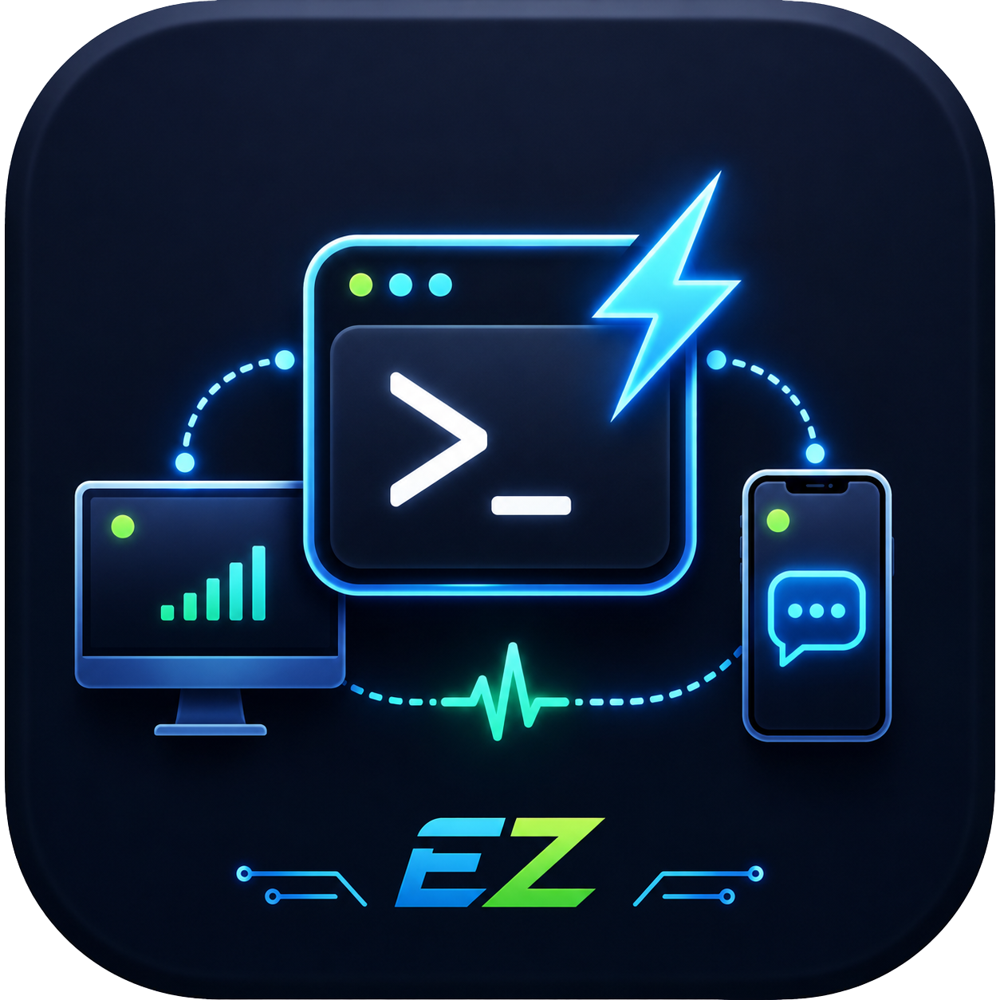
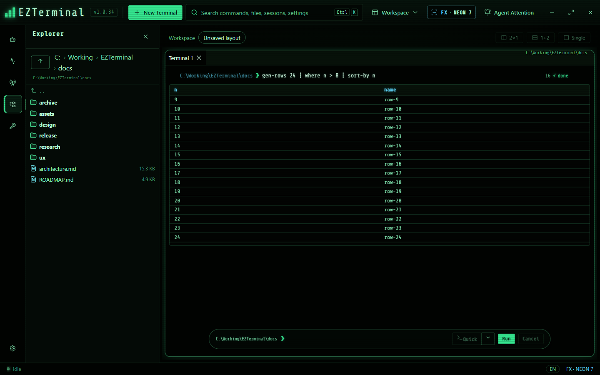
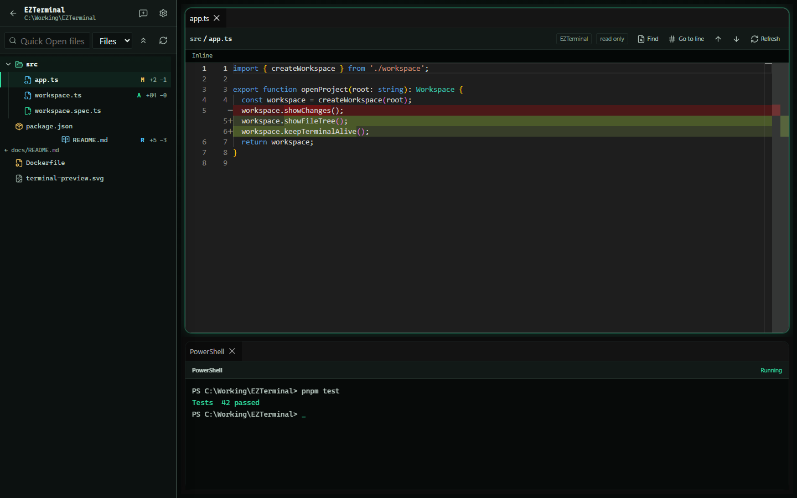
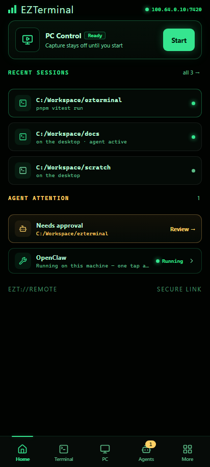
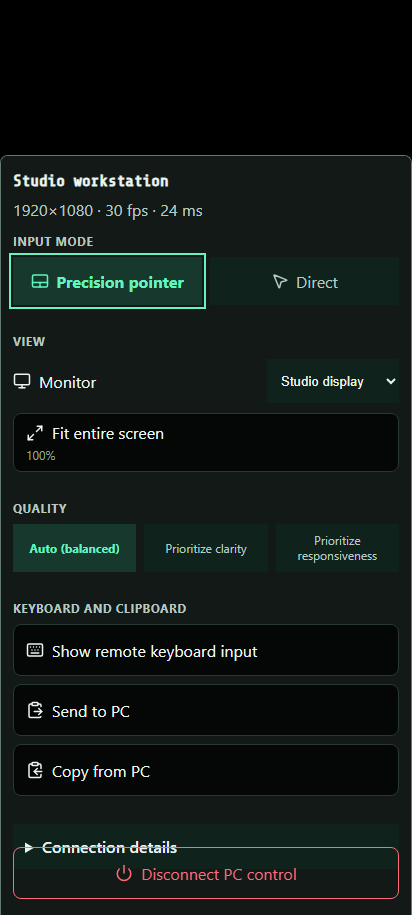

<div align="center">



# EZTerminal

**A Windows terminal that treats command output as typed data.**

Structured pipelines · block history · full PTY/TUI support · Agent workbench · Android remote control

[](https://github.com/dlwlgus9125/EZTerminal/releases/latest)
[](https://github.com/dlwlgus9125/EZTerminal/actions/workflows/ci.yml)

[](LICENSE)

[Download the latest release](https://github.com/dlwlgus9125/EZTerminal/releases/latest) ·
[Read the release notes](docs/release/release-notes-1.0.46.md) ·
[Review the security model](SECURITY.md)

<br />



</div>

## Why EZTerminal?

Most terminals flatten every result into text. EZTerminal keeps built-in command output as typed rows,
so filters and sorts operate on real columns and results render as virtualized tables. Commands that
need normal terminal behavior—including PowerShell, Git, Node.js, Codex, Claude, and full-screen
TUIs—run through ConPTY and xterm.js instead.

Each command lives in its own collapsible block with its status, working directory, output, and
cancellation controls. Tabs, splits, detached windows, saved layouts, files, projects, agents, and
remote sessions all live in the same keyboard-first workbench.

```text
gen-rows 24 | where n > 8 | sort-by n
ls | where size > 1000 | sort-by size
ps | where memory > 100mb | sort-by memory
```

## Highlights

- **Typed pipelines at interactive scale.** `ls`, `ps`, `history`, `gen-rows`, variables, `where`,
  and `sort-by` produce structured values. The table renderer stays windowed even with 100,000 rows.
- **A real terminal when text is the right interface.** External commands, interactive CLIs, and
  full-screen TUIs use ConPTY/xterm with search, Unicode 11, safe links, WebGL fallback, scrollback,
  selection-aware copy, paste protection, and byte backpressure.
- **A persistent multi-window workbench.** Independent sessions can be arranged as tabs and splits,
  moved into detached windows, saved as presets, and restored. v1.0.34 adds coordinated window
  parking and renderer recovery without discarding eligible live runs.
- **Projects and coding agents in context.** Browse a project tree, inspect full-file inline diffs
  beside a live terminal, manage worktrees, and follow Codex, Claude, or configured Agent sessions
  through attention, approval, history, resume, change-review, Project coordination, and managed
  merge states.
- **Files, SSH, and local operations tooling.** Use the built-in Explorer, bounded file previews,
  drag-to-terminal paths, TOFU-verified SSH, loopback-only SSH forwards, a system monitor, and
  optional Npcap packet capture.
- **Four visual modes without sacrificing terminal semantics.** Matrix CRT, Dark, Light, and High
  Contrast themes share responsive, localized, keyboard- and screen-reader-aware UI contracts.

## Project workbench

The desktop Project Workspace keeps the file tree, a read-only full-file inline diff, and the live
PTY topology together. Opening files or switching between wide and narrow layouts does not recreate
the terminal session.



## Agent collaboration

A live Codex or Claude session can join its Project with an alias, role, and
task. EZTerminal previews the generated brief before you send it, then exposes
the Project's joined sessions through a capability available only inside that
terminal:

```powershell
ezterminal-agent list
ezterminal-agent read Reviewer --lines 80
'Please review the candidate.' | ezterminal-agent prompt Reviewer --stdin --wait
ezterminal-agent wait Reviewer --until done
ezterminal-agent merge request --target main --wait
```

Desktop Settings can also create preset-based Codex/Claude Personas, arrange 2–8 of them into a Team,
and optionally prefill a reusable desired outcome with observable completion criteria. A Team run
keeps the Project purpose as read-only context, freezes one target commit, starts only its Planner,
and waits for a structured plan to be
reviewed. Approval returns the Planner's assignment and opens each other approved member in a
separate managed worktree; partial launch failures stay visible and retryable.

Managed merge never turns an arbitrary terminal command into an approval
button. It accepts only committed changes from an EZTerminal-managed worktree,
creates a detached candidate, runs the Project validations, and rechecks both
Git heads before an approved fast-forward. Desktop supports explicit approval,
a reasoned failed-validation override, or an exact one-shot grant. Android can
approve or deny a normally validated candidate.

## Android companion

The Android app connects to the desktop over a user-selected trusted VPN. It can resume terminal
sessions, browse and transfer files, surface Agent attention, inspect system status, and explicitly
start PC Control for the visible, unlocked Windows desktop.

<table>
  <tr>
    <td width="50%" align="center">
      
      <br />
      <sub>Sessions and attention at a glance</sub>
    </td>
    <td width="50%" align="center">
      
      <br />
      <sub>Explicit PC Control input and streaming controls</sub>
    </td>
  </tr>
</table>

PC Control supports monitor selection, precision pointer and direct touch, physical or on-screen
keyboard input, Korean IME, Bluetooth keyboard and mouse input, adaptive streaming profiles, and
explicit text clipboard actions. Local display and input remain active, only one phone controls the
GUI at a time, and the desktop can disconnect the controller at any moment. Lock screen, UAC secure
desktop, audio, privacy mode, and Ctrl+Alt+Delete are not supported.

## Install

The current stable release is **v1.0.46**.

| Platform | Supported system | Release asset |
| --- | --- | --- |
| Windows desktop | Windows 10 22H2 or Windows 11, x64 | `EZTerminal-Setup.exe` |
| Android companion | Android 10 / API 29 or newer | `EZTerminal-Android-1.0.46-vc67.apk` |

Download both artifacts, `release-manifest.json`, and `SHA256SUMS.txt` from the
[latest GitHub Release](https://github.com/dlwlgus9125/EZTerminal/releases/latest).

> [!IMPORTANT]
> The v1.0.46 Windows installer is published unsigned while the SignPath Foundation application is
> pending, so Windows displays an unknown-publisher warning. Verify the release manifest and SHA-256
> checksums before opening it. The in-app updater performs the same digest verification and never
> installs an update silently.

Android 1.0 uses the project's long-term release certificate. If an older debug-signed APK is
installed, uninstall it before installing 1.0; Android cannot update across that signing-key change,
and uninstalling removes the app's saved pairing data.

## Security and privacy

Remote access is **off by default**. Enabling it binds the bridge only to the explicitly selected
Tailscale, WireGuard, or other trusted VPN interface. The current `ws://` transport must stay inside
that encrypted tunnel—never expose it with router port forwarding.

Pairing grants remote command execution and filesystem access; opening PC Control additionally grants
visible-desktop, keyboard, pointer, and explicit text-clipboard access. Treat the pairing token like
a password to the Windows account. Tokens use OS-backed protection on Windows, Android credentials
use Keystore-backed storage, and token rotation revokes existing access.

EZTerminal does not operate an analytics, advertising, crash-reporting, or telemetry service. See the
full [security policy](SECURITY.md), [privacy policy](PRIVACY.md), and
[code-signing policy](CODE_SIGNING_POLICY.md) before enabling remote access or redistributing builds.

## Build from source

You need Windows 10 22H2 or Windows 11 x64, Node.js `>=22.12 <25`, pnpm `10.33.4`, and a Rust
toolchain. The Windows native host is built automatically by `pnpm start` and `pnpm make`.

```powershell
corepack enable
pnpm install
pnpm start
```

Useful development commands:

```powershell
pnpm test       # documentation checks, unit tests, OS tests, and policy guards
pnpm e2e        # ordinary Playwright + Electron end-to-end suite
pnpm make       # Windows installer -> out/make/nsis/x64/EZTerminal-Setup.exe
```

The Android Capacitor project lives in [`mobile/`](mobile/). Current process boundaries, trust
boundaries, data flows, and native components are documented in the
[architecture guide](docs/architecture.md).

## Documentation

| Topic | Entry point |
| --- | --- |
| Architecture and subsystem ownership | [docs/architecture.md](docs/architecture.md) |
| Product direction and unimplemented candidates | [docs/ROADMAP.md](docs/ROADMAP.md) |
| Visual identity and UX contracts | [DESIGN.md](DESIGN.md) · [frontend design](docs/ux/frontend-design.md) |
| Agent collaboration and managed merge | [docs/design/agent-collaboration.md](docs/design/agent-collaboration.md) |
| Current release | [v1.0.46 notes](docs/release/release-notes-1.0.46.md) · [1.0.46 validation policy](docs/release/validation-policy-1.0.46.md) |
| Terminal, remote, lifecycle, and integration contracts | [docs/design/](docs/design/) |
| Release history | [CHANGELOG.md](CHANGELOG.md) |

## Tech stack

Electron · React · TypeScript · Dockview · xterm.js · node-pty / ConPTY · Capacitor · Rust · Vite · Playwright

## License

[MIT](LICENSE) © 2026 dlwlgus9125
