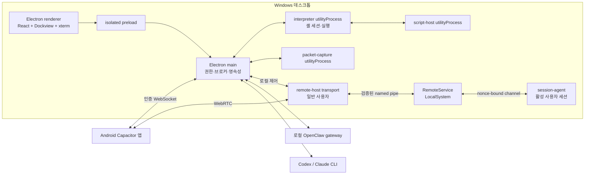
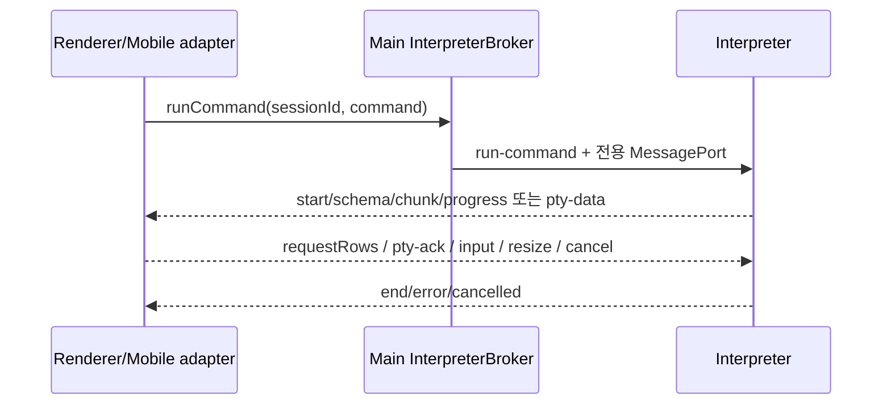

# EZTerminal 아키텍처

> 문서 상태: **공식 아키텍처 진입점**
>
> 이 문서는 현재 구현된 시스템의 경계와 변경 계약을 설명한다. 미래 후보는
> [`ROADMAP.md`](ROADMAP.md)에만 기록하며, 완료 과정과 과거 설계는
> [`archive/`](archive/README.md)에 보존한다.

## 1. 문서 권한과 변경 원칙

EZTerminal은 코드만을 유일한 진실로 취급하지 않는다. 코드가 현재 구현 구조를
증명하고, 활성 계약과 실행 가능한 검증이 그 구조에서 지켜야 할 의도를 고정한다.

| 대상 | 권한 원천 |
| --- | --- |
| 프로세스·타입·실제 데이터 흐름 | 제품 소스와 공유 스키마 |
| 기능·보안·UX 불변조건 | 이 문서, `docs/design/`, `docs/ux/`, 대응 테스트 |
| 버전·아티팩트 이름 | [`release/version.json`](../release/version.json) |
| Visual identity·시각 판단 | [`DESIGN.md`](../DESIGN.md) |
| 화면 IA·flow·state·responsive·접근성 | [`frontend-design.md`](ux/frontend-design.md) |
| 정확한 theme·token 값 | [`themes.ts`](../src/renderer/themes.ts), [`ui-tokens.css`](../src/renderer/styles/ui-tokens.css) |
| 시각 증거 | 고정 핸드오프 manifest, production Storybook, 시각 테스트 |
| 과거 판단과 출시 증거 | [`CHANGELOG.md`](../CHANGELOG.md), `docs/archive/`, 버전별 `docs/release/` |

코드와 활성 계약이 어긋나면 문서를 코드에 자동으로 맞추지 않는다. 먼저 회귀인지
의도된 제품 변경인지 결정하고, 의도된 변경일 때만 코드·계약·검증을 같은 변경에서
함께 갱신한다. 아카이브 문서는 현재 동작의 근거로 사용하지 않는다.

## 2. 시스템 경계

지원 제품은 Windows 10 22H2/Windows 11 x64 데스크톱과 Android 10(API 29)
이상의 동반 앱이다. 데스크톱이 셸 세션과 로컬 권한을 소유하고 Android는 사용자가
선택한 신뢰 VPN을 통해 연결되는 원격 클라이언트다.

### 소유권 규칙

- **Renderer**는 표시와 사용자 입력만 소유한다. 파일시스템, 프로세스 생성, 비밀값,
  네이티브 권한을 직접 소유하지 않는다.
- **Preload**는 `contextIsolation` 경계에서 허용된 좁은 API만 노출한다.
- **Main**은 창, IPC 검증, 영속 저장, OS 서비스, 원격 listener, utility process와
  비밀값을 소유한다. 대용량 명령 출력의 중계 경로가 되어서는 안 된다.
- **Interpreter**는 `ShellSession`, 실행, 파서·평가기, 결과 저장과 PTY/SSH 실행을
  소유한다. 전역 `process.chdir()` 대신 세션별 cwd/env/variables를 유지한다.
- **공유 모듈**은 실행 로직이 아니라 IPC·원격 프로토콜·저장 스키마와 순수 검증기를
  소유한다.
- **Android**는 데스크톱 세션의 클라이언트다. 로컬 셸 상태나 권한을 별도로 복제하지
  않는다.
- **RemoteService**는 네트워크를 파싱하지 않는 로컬 권한 경계다. 현재 화면 캡처와
  실제 입력 주입은 일반 사용자 transport가 수행하며, 서비스와 session-agent는
  설치·신원·활성 세션·capability/liveness를 검증한다.

## 3. 세션, 실행과 표면

`ShellSession`은 명령 사이에 cwd, 환경 오버라이드와 변수를 보존한다. 명령마다
생성되는 `ExecutionSession`은 파싱, 평가, 출력 프레이밍, 취소와 결과 정리를
소유한다. 한 셸 세션의 foreground 실행은 직렬화되고 서로 다른 셸 세션은 독립적으로
실행할 수 있다.

Main의 `InterpreterBroker`는 interpreter handle, 세션 생성, 실행 포트, attach와
상관관계 상태의 단일 소유자다. 로컬 preload IPC와 원격 WebSocket은 같은 broker를
사용하므로 세션 생성과 실행 의미론을 별도로 구현하지 않는다. `SessionDirectory`는
main이 알고 있는 세션과 최신 cwd를 보존하고 interpreter 교체 시 복원 입력을 제공한다.

세션 자체와 세션을 보여 주는 표면은 분리된다. Dockview 패널, 분리 창, Android
화면이 한 세션을 관찰할 수 있으며 `SessionSurfaceAuthority`와 renderer의 coordinator가
표면 등록·이동·닫기를 직렬화한다. 세션 파괴는 예상 실행 ID를 다시 비교하는 guarded
요청으로 처리하여 검사와 실행 사이 상태 변화에 fail closed한다.

상세 계약은 [`workbench-lifecycle.md`](design/workbench-lifecycle.md)에 있다.

## 4. 명령과 스트리밍 경로

- 구조화 결과는 `PipelineData`의 value/list-stream/byte-stream 경계를 따라 흐른다.
  streaming 연산자는 lazy하게 전달하고 `sort-by` 같은 buffering 연산자만 명시적으로
  materialize한다.
- 표 결과는 `ResultStore`에 남고 renderer는 viewport에 필요한 행만 credit 방식으로
  요청한다. 대량 행 전체를 React state에 저장하지 않는다.
- PTY와 SSH 바이트는 xterm으로 직접 흐르되 소비 완료 누적 ACK를 사용한다. 1 MiB
  high-water에서 pause하고 256 KiB low-water에서 resume하며, renderer는 64 KiB
  단위로 ACK한다. 취소는 배압과 독립된 탈출 경로다.
- 입력, resize, 취소, 비밀 프롬프트 응답은 같은 실행 포트의 제어 프레임이며 모든
  프레임은 공유 discriminated union으로 검증한다.
- 로컬 PTY는 bounded headless snapshot과 최근 출력으로 late attach를 복원한다.
  연속성을 증명하지 못하면 명시적 경고와 bounded fallback을 사용한다. SSH late
  attach는 불완전 화면을 보여 주지 않고 현재 fail closed한다.

파서, 외부 실행, SSH, 스크립팅과 배압의 상세 계약은
[`terminal-runtime.md`](design/terminal-runtime.md)에 있다.

## 5. 데스크톱 workbench와 영속성

Desktop renderer는 Dockview를 UI adapter로 사용하고 `WorkbenchCoordinator`가 패널
ID, 레이아웃 transaction, 저장 순서와 최근 패널 전환을 소유한다. `App.tsx`는 제품
조합점이지만 Dockview mutation 규칙과 세션 수명 규칙을 직접 복제하지 않는다.

초기 renderer graph에는 terminal shell과 navigation처럼 첫 화면에 필요한 모듈만
둔다. Explorer, Agents, Monitor, Remote, OpenClaw, Settings와 rich preview는
공유 `FeatureModuleLoader`를 통해 기능 단위로 불러온다. 동일 loader의 intent·background·
render 요청은 하나의 promise를 공유하며, chunk 실패는 해당 기능 안에서 Retry/Close로
복구한다. 기능 하나의 로드 실패가 terminal workbench 전체를 교체해서는 안 된다.

`PaneRegistry`는 mounted pane의 live handle만 보유한다. cwd와 실행 상태는 pane 변경
notification으로 전달하고 header의 경과 시간처럼 실제 시계 표시만 저빈도 timer를
사용한다. command draft나 output 변화가 App 전체 render를 유발하지 않으며, unmount된
pane의 cwd를 별도 compatibility cache에 남기지 않는다.

Main만 사용자 데이터 파일을 쓴다. 레이아웃과 프리셋은 Zod 스키마로 sanitize한 뒤
원자적으로 저장하며, 손상된 입력은 quarantine/fallback한다. 레이아웃은 패널 구조와
표시 설정을 보존하지만 live PTY나 명령 결과를 직렬화하지 않는다. 분리 창과 다시
도킹하는 표면도 동일한 세션·닫기 권한 계약을 따른다.

사용자 주도 terminal copy도 main-owned OS side effect다. Renderer의 각 terminal 표면은
선택과 source document만 캡처하고, 공통 renderer 경계와 context-isolated preload IPC를
거쳐 main이 Electron clipboard를 한 번 쓴다. 사용자 Copy와 OSC 52 policy는 별도
capability이며 상세 소유권과 실패 계약은
[`terminal-clipboard.md`](design/terminal-clipboard.md)에 있다.

시각·상호작용 규범은 [`frontend-design.md`](ux/frontend-design.md), 수명과 저장 규범은
[`workbench-lifecycle.md`](design/workbench-lifecycle.md)가 소유한다.

Project-wide Architecture/Workflow/Sequence/Dataflow/Lifecycle 지도는 repo-owned schema v2
근거와 로컬 Git provenance에서 deterministic canonical scene을 만든 뒤 native Dockview
surface와 SVG/PNG export가 함께 사용한다. Main은 binding, Production last-good cache,
exact-fingerprint approval, persisted Agent job과 atomic verification receipt export를 소유한다.
저장·검증·승인·export 경계와 Agent authoring protocol은
[`project-map.md`](design/project-map.md)가 소유한다.

## 6. 원격 터미널과 Android

`RemoteRuntimeController`가 선택된 신뢰 VPN 주소에서 remote bridge를 시작하고
token·origin·프로토콜 버전을 인증한다. 현재 wire contract는
[`remote-protocol.ts`](../src/shared/remote-protocol.ts)의 단일 지원 버전을 사용하며,
호환되지 않는 클라이언트는 기능을 추측하지 않고 재페어링/업데이트 상태로 전환한다.

Android의 `WsEzTerminalTransport`는 데스크톱 preload API와 같은 의미의 adapter를
제공한다. 실행별 가상 port를 통해 renderer controller를 재사용하고, 인증 이후
구독·세션·실행 attach를 복구한다. 자격증명은 Android 보안 저장소에만 지속하며
plaintext fallback은 제공하지 않는다. 네트워크 단절은 UI 상태를 보존한 채 제한된
재연결을 수행하고 인증 거부나 프로토콜 불일치는 무한 재시도하지 않는다.

자세한 인증, capability, lease와 복구 계약은
[`remote-terminal.md`](design/remote-terminal.md)에 있다.

## 7. PC Control과 native host

그래픽 제어는 인증 WebSocket에서 lifecycle·signaling을 전달하고 VPN 주소에 묶인
WebRTC에서 영상과 입력을 전달한다. 한 Android 설치만 controller lease를 가지며
로컬 Disconnect, bridge 중지, token 회전, 연결 종료가 원격 제어보다 우선한다.

Rust `remote-host`는 transport, LocalSystem service와 활성 세션 agent 모드를 한
바이너리에서 분리한다. capability 광고는 신뢰 네트워크, 설치된 서비스, 활성 세션
agent handshake가 모두 준비된 경우에만 열린다. 현재 지원 범위는 표시 중인 잠금
해제 세션의 GDI/OpenH264 화면, 모니터 선택, 명시적 clipboard와 일반 입력이다.
lock/UAC secure desktop과 Software SAS/Ctrl+Alt+Delete는 광고하지 않는다.

상세한 현재 범위와 실패 정리는 [`remote-desktop.md`](design/remote-desktop.md)에 있다.

## 8. 외부 통합

OpenClaw gateway와 Agent CLI는 EZTerminal 밖의 프로세스다. Main은 관찰·명시적 제어와
bounded adapter만 제공하며 앱 종료 시 외부 서비스를 임의로 종료하지 않는다.
OpenClaw token은 main과 전용 view/proxy 경계 밖으로 직접 노출하지 않고, Codex/Claude
이력·hook·승인 데이터는 필요한 UI 상태로만 제한한다.

외부 프로세스 수명, 비밀값, 프록시와 기록 제한은
[`external-integrations.md`](design/external-integrations.md)에 있다.

Codex/Claude의 Project 참여, 주소 가능한 session control과 검증된 변경의 승인·자동
머지는 [`agent-collaboration.md`](design/agent-collaboration.md)가 소유한다. 참여하지 않은
일반 terminal과 generic Agent는 이 협업 capability를 받지 않는다.

## 9. 장애와 종료

- interpreter 종료는 broker의 모든 pending 요청을 정리하고 renderer에 복구 가능한
  실패로 전달한다. 죽은 interpreter에 새 실행을 보낸 것처럼 성공을 가장하지 않는다.
- renderer crash, 창 닫기, 앱 종료는 coordinator를 통해 실행·표면·utility process와
  로컬 listener를 bounded 순서로 정리한다.
- 원격 transport나 native 구성요소 장애는 터미널 전용 기능까지 불필요하게 끄지 않되,
  준비되지 않은 capability는 광고하지 않는다.
- 진단은 로컬 bounded 로그와 crash dump만 사용하며 token, 명령 내용, transcript,
  clipboard, 입력, SDP/ICE 비밀을 기록하지 않는다.
- 관찰용 refresh는 완료 뒤 다음 실행을 예약해 겹치지 않는다. resource profile은
  allow-list된 system stats, device/forward/session 목록의 주기와 optional feature preload만
  바꾸며 timeout, liveness, reconnect, lease, backpressure와 close safety 시간은 바꾸지
  않는다.

## 10. 리소스 프로필과 개발 진단

`UiResourceProfile`은 desktop settings와 Android device-local preferences에 각각
저장되고 remote wire에는 포함되지 않는다. 기본 `balanced`는 idle preload와 표준 관찰
주기, `low-resource`는 사용자 intent에서만 preload하고 관찰 주기를 두 배로 늘리며,
`high-responsiveness`는 optional feature를 즉시 preload한다. 이미 로드된 JavaScript
module은 browser module cache에서 임의 unload하지 않으므로 저자원 전환 뒤 완전한
메모리 회수는 다음 앱 시작부터 적용된다.

`pnpm profile:runtime`은 fresh unpacked build를 임시 profile로 반복 실행해 interactive
startup, optional feature intent-to-ready, process working set과 renderer chunk 크기를
`test-results/runtime-profile.json`에 기록하는 개발 진단이다. 이 파일은 release evidence가
아니며 release performance benchmark와 gate를 대체하지 않는다.

## 11. 변경 체크리스트

1. 변경이 어느 프로세스와 신뢰 경계의 소유권인지 먼저 결정한다.
2. 공용 IPC, 저장 또는 원격 wire shape가 바뀌면 공유 스키마와 양쪽 adapter를 함께
   변경하고 호환/마이그레이션 정책을 명시한다.
3. 현재 기능·UX·보안 불변조건이 달라지면 대응 활성 계약과 실행 가능한 테스트를
   같은 변경에서 갱신한다.
4. 새 활성 계약 문서는 이 문서에서 연결하고, 완료 계획은 활성 `design/`에 남기지
   않는다.
5. [`AGENTS.md`](../AGENTS.md)의 일반 검증과 `pnpm docs:check`를 통과시킨다. 성능
   벤치마크는 사용자가 명시적으로 요청한 경우에만 실행한다.

## 근거 소스

- [`src/main/main.ts`](../src/main/main.ts)
- [`src/main/interpreter-broker.ts`](../src/main/interpreter-broker.ts)
- [`src/interpreter/interpreter-process.ts`](../src/interpreter/interpreter-process.ts)
- [`src/shared/ipc.ts`](../src/shared/ipc.ts)
- [`src/shared/remote-protocol.ts`](../src/shared/remote-protocol.ts)
- [`src/renderer/App.tsx`](../src/renderer/App.tsx)
- [`src/renderer/feature-loader.tsx`](../src/renderer/feature-loader.tsx)
- [`src/renderer/async-poller.ts`](../src/renderer/async-poller.ts)
- [`src/shared/resource-profile.ts`](../src/shared/resource-profile.ts)
- [`mobile/src/App.tsx`](../mobile/src/App.tsx)
- [`native/remote-host/src/main.rs`](../native/remote-host/src/main.rs)

## 검증

- [`src/main/interpreter-broker.test.ts`](../src/main/interpreter-broker.test.ts)
- [`src/interpreter/interpreter-process.test.ts`](../src/interpreter/interpreter-process.test.ts)
- [`src/renderer/workbench-coordinator.test.ts`](../src/renderer/workbench-coordinator.test.ts)
- [`src/renderer/feature-loader.test.ts`](../src/renderer/feature-loader.test.ts)
- [`src/renderer/async-poller.test.ts`](../src/renderer/async-poller.test.ts)
- [`src/shared/resource-profile.test.ts`](../src/shared/resource-profile.test.ts)
- [`src/main/remote-bridge.test.ts`](../src/main/remote-bridge.test.ts)
- [`mobile/src/transport/ws-ezterminal.test.ts`](../mobile/src/transport/ws-ezterminal.test.ts)
- [`e2e/`](../e2e/)
- [`visual/storybook.visual.spec.ts`](../visual/storybook.visual.spec.ts)
