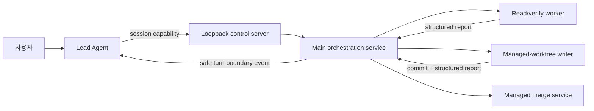

# Lead 협업 계약

> 문서 상태: **활성 규범 계약**
>
> 범위: Lead 중심 depth-1 worker 오케스트레이션, Project 권한 상한, 관리형 병합,
> 설치형 ACP adapter와 desktop/mobile 표시 및 제어 경계.

EZTerminal의 협업은 사용자가 현재 Project의 Lead 한 명과 대화하고, Lead가 필요할 때만
depth-1 worker를 만드는 모델이다. 별도의 그래프 편집기, 지식 그래프, 팀 템플릿, 위원회,
스케줄러 또는 heartbeat UI는 제공하지 않는다. 구현은 Paseo의 사용자 경험에서 영감을 받은
clean-room 설계이며 Paseo의 AGPL 소스 코드를 포함하거나 번역하지 않는다.

## 사용자 모델

- Lead는 일반 Codex/Claude 세션처럼 직접 읽고 수정할 수 있다.
- 병렬 조사, 격리된 수정 또는 독립 검증이 실제로 유리할 때만 worker를 위임한다.
- 사용자는 worker에게 직접 prompt를 쓰지 않는다. worker의 상태, 결과, 중지 및 보관만
  Lead terminal의 compact strip에서 다룬다.
- worker는 다른 worker를 만들 수 없다. 한 cycle은 최대 4개 동시 worker, 총 12개 worker,
  2시간이며 Project 정책은 이 상한을 더 낮출 수 있다.
- dependency는 main이 DAG로 검증하고 실행하지만 UI에는 작은 선행 작업 설명만 보여 준다.

## 권위와 데이터 흐름

Main process만 정책, run/task graph, worker process, event queue와 merge 요청을 변경한다.
Renderer와 Android는 revisioned snapshot의 projection이며 상태를 추정하지 않는다. Lead와
built-in worker는 session별 bearer capability로 loopback control server를 사용한다. ACP worker는
동일한 main-owned service에 직접 구조화된 report를 제출하며 worker 생성 capability를 받지 않는다.

완료, 실패, 입력 대기 및 merge 준비 event는 bounded queue에 보존한다. Main은 Lead의 activity가
안전한 turn 경계에 도달했을 때만 요약을 전달한다. 화면이나 tab을 닫아도 실행은 계속되며 Stop은
해당 worker process를 실제로 종료한다.

## Project 정책과 권한

협업은 Project마다 기본적으로 꺼져 있다. 사용자가 명시적으로 켜고 다음 상한을 저장한다.

- 허용 worker profile
- `ask`, `safe-auto`, `custom` 권한 모드
- 동시 수, 누적 수, cycle 시간
- 허용/차단 경로, 변경 파일/줄 수
- 대상 branch와 필수 validation

`ask`는 권한이 필요한 ACP tool과 merge를 사용자에게 묻는다. `safe-auto`와 `custom`은 adapter가
보고한 안전한 tool kind만 협력적으로 허용할 수 있지만, 자동 merge는 allow path, deny path,
크기 제한, 필수 validation, 독립 검증과 깨끗한 target을 모두 통과해야 한다. 비어 있는 allow
path나 validation은 자동 merge 허용으로 해석하지 않는다. run은 저장된 Project 상한을 높일 수
없다.

Provider 권한 신호는 보안 경계의 일부지만 OS sandbox를 대신하지 않는다. 특히 설치형 ACP
adapter는 사용자의 OS 권한으로 실행되므로 설치 검토 화면과 문서에서 이를 명시한다.

## 작업 격리와 병합

읽기·검증 worker는 현재 Project workspace를 읽기 전용 profile로 사용한다. 쓰기 worker는 고정된
base에서 만든 전용 managed worktree를 사용한다. 동시에 실행 가능한 writer의 write scope가
겹치면 생성을 거부하며, 명시적으로 선행 writer에 의존하는 후속 작업만 queue할 수 있다.

쓰기 성공 report는 깨끗하게 commit된 exact source head와 일치해야 한다. 다른 session의 verify
worker가 같은 head를 구조화된 report로 승인하기 전에는 `awaiting-merge`가 될 수 없다. 이후에도
main은 현재 head, cleanliness, 경로, 파일/줄 수, mode·symlink·submodule 위험, validation과 target
revision을 다시 확인한다. 정책 밖 변경이나 실패 validation은 사용자 결정을 요구한다.

## ACP adapter 설치와 실행

Desktop Settings는 `.ezadapter` 파일을 고르는 native picker와 검토 dialog를 제공한다. 경로는
renderer로 전달하지 않는다. Bundle은 다음을 만족해야 한다.

- 엄격한 schema v1 manifest와 ACP v1 stdio JSON-RPC
- Ed25519 publisher signature와 manifest에 열거된 모든 asset의 SHA-256/size 일치
- traversal, 절대 경로, device 이름, backslash/colon, symlink/reparse, 암호화 entry,
  중복·대소문자 충돌, extra asset 및 압축 폭탄 거부
- 256 MiB archive, 512 MiB expanded, 256 entry, 64 KiB manifest 상한
- `win32-x64` executable의 initialize health check 통과

최초 publisher key는 사용자가 fingerprint와 capability를 보고 신뢰해야 한다. 업데이트는 같은
key만 허용하며 새 capability는 별도 승인을 요구한다. 서명은 publisher 무결성과 업데이트
연속성을 뜻할 뿐, adapter를 sandbox하지 않는다. 설치 파일은 content-addressed directory에
두고 활성·건강한 profile만 Lead 정책에서 선택할 수 있다. Adapter 설치/삭제는 desktop 전용이다.

ACP runtime은 newline-delimited JSON-RPC로 `initialize`, `session/new`, `session/prompt`,
`session/cancel`, `session/update`, `session/request_permission`만 사용한다. 인증을 요구하거나 ACP
version이 다른 adapter는 현재 지원하지 않는다. Transcript와 오류는 bounded하며 민감한 원문을
영구 orchestration store에 저장하지 않는다.

## UI와 mobile 동등성

Lead terminal의 strip은 worker가 없으면 렌더링하지 않는다. 접힌 상태는 active, 입력 필요,
merge 준비, 실패 수만 보여 준다. 펼친 상태에는 task, dependency, provider, scope, 경과 시간,
bounded 결과, Stop과 완료 worker Archive를 제공하며 worker composer는 없다. Android는 같은
snapshot과 action을 compact strip/full-screen sheet로 표현한다. Project 목표, 기본 target branch,
validation 명령과 권한 정책도 모바일에서 직접 저장할 수 있다. Adapter 설치만 desktop 전용이다.

Project 상세의 Collaboration 설정은 enable, profile allowlist, 권한 모드와 모든 상한을 소유한다.
Settings의 Agents 영역은 integration 다음에 profile 및 adapter 관리를 둔다. 구 Persona/Team
편집기와 실행 dialog는 제공하지 않는다.

## 지속성과 마이그레이션

- `agent-orchestration-policies.json`: Project 정책
- `agent-orchestration-runs.json`: bounded run/task/event metadata
- `agent-adapters.json`: 설치 metadata와 publisher trust
- adapter bundles: content-addressed 실행 파일

Prompt 전문, terminal transcript, provider credential, bearer token과 validation 출력 전문은 위
store에 기록하지 않는다. 시작 시 비종료 run은 `interrupted`로 바꾸며 존재하지 않는 process를
복원했다고 표시하지 않는다.

기존 `agent-team-catalog.json` 또는 `agent-team-runs.json`을 발견하면 Collaboration 접근을 잠그고
삭제 대상 개수를 보여 준다. 사용자가 확인하면 두 legacy 파일을 삭제하고 migration receipt를
저장한다. 자동 변환, 구·신 모델 병행 또는 숨은 feature flag는 없다.

## 근거 소스

- [`src/main/agent-orchestration-service.ts`](../../src/main/agent-orchestration-service.ts)
- [`src/main/agent-orchestration-store.ts`](../../src/main/agent-orchestration-store.ts)
- [`src/main/acp-worker-runtime.ts`](../../src/main/acp-worker-runtime.ts)
- [`src/main/agent-adapter-service.ts`](../../src/main/agent-adapter-service.ts)
- [`src/main/agent-control-server.ts`](../../src/main/agent-control-server.ts)
- [`src/main/managed-merge-service.ts`](../../src/main/managed-merge-service.ts)
- [`src/renderer/LeadWorkersStrip.tsx`](../../src/renderer/LeadWorkersStrip.tsx)
- [`src/renderer/AgentCollaborationSettings.tsx`](../../src/renderer/AgentCollaborationSettings.tsx)
- [`mobile/src/MobileCollaborationPolicySheet.tsx`](../../mobile/src/MobileCollaborationPolicySheet.tsx)
- [`mobile/src/MobileLeadWorkersStrip.tsx`](../../mobile/src/MobileLeadWorkersStrip.tsx)
- [`src/shared/agent-orchestration.ts`](../../src/shared/agent-orchestration.ts)
- [`src/shared/agent-adapter.ts`](../../src/shared/agent-adapter.ts)

## 검증

- [`src/main/agent-orchestration-service.test.ts`](../../src/main/agent-orchestration-service.test.ts)
- [`src/main/agent-adapter-service.test.ts`](../../src/main/agent-adapter-service.test.ts)
- [`src/main/managed-merge-service.test.ts`](../../src/main/managed-merge-service.test.ts)
- [`src/main/remote-bridge.test.ts`](../../src/main/remote-bridge.test.ts)
- [`src/renderer/LeadWorkersStrip.test.tsx`](../../src/renderer/LeadWorkersStrip.test.tsx)
- [`mobile/src/MobileCollaborationPolicySheet.test.tsx`](../../mobile/src/MobileCollaborationPolicySheet.test.tsx)
- [`mobile/src/transport/ws-ezterminal.test.ts`](../../mobile/src/transport/ws-ezterminal.test.ts)
