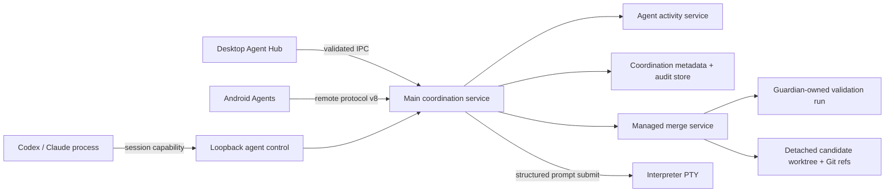

# Agent 협업과 관리 머지 계약

> 문서 상태: **활성 규범 계약**
>
> 범위: Codex/Claude Agent 상태, Project 참여자 조정, 로컬 Agent 제어 CLI,
> 관리 머지, desktop/mobile 승인과 영속성·개인정보 경계.

## 제품 의도

EZTerminal은 여러 Agent를 대신 지휘하는 자율 오케스트레이터가 아니다. 사용자가
Project 목표와 각 Agent의 역할을 정하고, 주소 가능한 세션 사이의 대화를 시작하며,
검증된 변경만 명시적으로 합치는 human-led 작업 공간이다.

Herdr에서 유효했던 개념인 주소 가능한 세션, 역할·작업 배정, Agent 간 메시지와
사람이 소유하는 merge gate는 EZTerminal의 기존 Project·PTY·worktree·remote 구조에
흡수했다. Herdr 프로세스나 저장 형식, UI 흐름을 런타임 의존성으로 가져오지 않는다.
일반 터미널과 generic Agent는 기존 동작을 유지하고 Project 협업은 Codex와 Claude에만
열린다.

## 소유권과 데이터 흐름

- `AgentActivityService`가 provider hook, process 수명과 PTY readiness를 하나의 상태로
  합친다. Renderer, mobile과 CLI는 이 projection을 재해석하지 않는다.
- `AgentCoordinationService`가 Project 설정, 현재 참여자, rollup과 merge request의
  revisioned snapshot을 만든다.
- `AgentControlServer`는 임의 localhost 포트의 session capability를 검증한다. 참여하지
  않은 세션의 descriptor는 dormant 상태이며 같은 Project 밖의 Agent를 읽거나 제어할
  수 없다.
- prompt 전달과 terminal 읽기는 interpreter의 structured PTY 경로를 사용한다. Main이
  transcript를 복제하거나 raw keystroke를 직접 주입하지 않는다.

## Agent 상태와 focus 의미

공유 상태는 `starting`, `working`, `blocked`, `done`, `idle`, `error`, `unknown`이다.
`stateSeq`는 activity별 단조 증가 sequence이며 wait와 focus 경쟁을 막는다.

| 상태 | 의미 |
| --- | --- |
| `starting` | provider process는 시작됐지만 structured interaction 준비가 확인되지 않음 |
| `working` | provider가 turn을 처리 중이거나 PTY가 interactive-ready 상태로 실행 중 |
| `blocked` | provider permission hook이 현재 한 결정을 기다림 |
| `done` | turn 완료를 아직 사용자가 확인하지 않음 |
| `idle` | 완료 상태를 사용자가 focus하여 확인했으며 다음 prompt를 받을 수 있음 |
| `error` | provider 또는 process가 실패함 |
| `unknown` | lifecycle 근거가 충분하지 않음 |

Provider hook을 한 번 관찰한 뒤에는 hook lifecycle이 turn 상태의 권위 원천이고 process
종료는 항상 `live=false`의 권위 원천이다. `interactiveReady`가 거짓이면 UI나 CLI는
상태 이름만 보고 prompt를 보내지 않는다. `done` activity를 열면 정확한 `stateSeq`를
mark-seen하여 `idle`로 바꾸며, 오래된 focus 요청은 새 turn을 덮지 않는다.

## Project 참여와 대화

Project coordination 설정은 목표, 기본 target branch와 순서가 있는 validation command를
소유한다. 수정은 `configRevision` compare-and-swap으로 저장되어 두 창의 오래된 편집이
서로 덮어쓰지 않는다.

사용자는 live Codex/Claude activity에 Project 안에서 유일한 alias, role과 task를
배정한다. 참여 결과는 Project 목표, 배정된 task, merge target, 검증 명령과 CLI 사용법을
포함한 brief를 생성하지만 자동 전송하지 않는다. 사용자가 내용을 검토·편집한 뒤
**Send**를 눌러야 Agent prompt가 된다. 참여자와 brief는 메모리에만 있으며 activity가
종료되거나 Leave하면 즉시 폐기된다.

`ezterminal-agent`는 참여한 Agent가 같은 Project의 참여자를 `list`, `read`, `prompt`,
`wait`하고 자신의 관리 머지를 `request`/`wait`하도록 한다. prompt 본문은 stdin으로만
받고, terminal 읽기와 응답 크기, wait 시간은 공유 상한으로 제한한다. `--wait`는 제출
전 `stateSeq`보다 새 sequence가 관찰됐을 때만 수락을 확정하며 timeout이면 outcome을
추측하지 않는다.

## Persona, Team과 계획 승인

Persona와 Team은 특정 Project에 종속되지 않는 전역 재사용 설정이다. Persona 기본 편집은
`Planner`, `Implementer`, `Reviewer`, `Tester`, `Custom` 프리셋, 이름, provider와 provider가
실제로 지원하는 permission만 요구한다. 프리셋은 안전한 icon·role·지침과 권한 기본값을
채우며, model·Claude effort·icon·role·지침은 선택적인 고급 설정에서 바꾼다. 프리셋 필드가
없는 기존 Persona는 `Custom`으로 표시하고 저장된 role과 지침을 보존한다. launch option은
provider별 allow-list 필드만 저장·전달하며 raw argument나 shell fragment를 받지 않는다.

Team은 2~8개의 Persona 순서와 그중 한 명인 Planner를 소유한다. 선택적인 기본 실행 목표는
원하는 결과와 1~12개의 순서 있는 완료 조건으로 구성된다. 설명과 Team 공통 지침은 고급
설정이며, 기존 값은 그대로 보존한다. 비어 있는 catalog에서는 사용자가 Planner와
Implementer의 준비된 provider를 각각 고른 뒤 두 Persona와 `Starter team`을 한 번의 atomic
catalog write로 만들 수 있다. 어느 하나라도 지원되지 않거나 catalog가 더는 비어 있지
않으면 아무 항목도 만들지 않는다. Catalog 수정은 compare-and-swap revision으로 충돌을
막고, 실행이 시작되면 해당 Team과 Persona의 snapshot을 실행 안에 고정한다.

Team 실행은 다음 경계를 지킨다.

1. 시작 dialog는 Project의 장기 목적을 읽기 전용 맥락으로 보여 주고, Team 기본 목표가
   있으면 이번 실행의 원하는 결과와 완료 조건에 복사한다. 사용자의 수정은 이번 run에만
   적용되고 Team 설정을 바꾸지 않는다. 새 run은 원하는 결과와 완료 조건 하나 이상이
   없으면 시작하지 않는다.
2. Main이 Project 장기 목적, run 결과·완료 조건, validation 설정, target branch의 정확한
   commit과 dirty 여부를 실행에 고정한다. dirty checkout은 사용자의 명시적 확인 없이는
   시작하지 않는다.
3. Planner 하나만 그 commit에서 만든 managed worktree에 시작한다. provider activity와
   exact session binding이 확인된 뒤 Main이 만든 planning brief를 한 번 전송한다.
4. Planner는 자신의 session capability로 `ezterminal-agent team plan submit <run-id>
   --revision <n> --stdin`을 호출한다. Main은 지정된 Planner activity, 현재 run revision,
   전체 Team의 assignment 또는 exclusion, validation ID와 전체 JSON 크기를 검증한다.
   이 호출은 사람의 결정을 기다리며, 승인되면 같은 응답으로 Planner 자신의 exact
   assignment brief를 돌려준다. Planner는 응답 전에 구현을 시작하지 않는다.
5. Desktop은 구조화된 계획을 사람에게 보여 주고 승인 전에는 다른 Persona를 시작하지
   않는다. 승인하면 Planner를 제외한 assignment별로 같은 고정 commit에서 서로 다른
   managed worktree와 session을 만들고, 각 Persona snapshot과 assignment로 만든 exact
   brief를 한 번 전송한다.
6. 일부 launch가 실패해도 성공으로 가장하거나 다른 Persona에 자동 재배정하지 않는다.
   해당 slot은 실패 원인을 남기고 생성된 worktree를 보존해 사용자가 retry, cancel 또는
   수동 복구를 선택할 수 있게 한다.

실행 상태는 `preparing-planner`, `planning`, `awaiting-review`, `launching`, `active`,
`partial`, `completed`, `canceled`, `failed`이며 member slot은 별도 상태를 가진다. UI는
revisioned snapshot을 표시할 뿐, transcript나 terminal 출력을 읽어 실행 상태를
추측하지 않는다. Team은 현재 desktop 전용이며 mobile remote protocol에 설정·시작·계획
승인 capability를 광고하지 않는다.

`complete`와 `cancel`은 Team의 계획 gate와 상태 추적을 끝내는 결정이다. 이미 열린 Agent
terminal을 강제 종료하거나 worktree를 삭제하지 않으며, UI는 이 차이를 action 근처에
명시한다.

## 관리 머지

관리 머지는 terminal의 일반 Git 명령을 승인하는 버튼이 아니다. EZTerminal이 만든
managed source worktree의 commit만 다음 순서로 처리한다.

1. 참여자·Project·worktree identity, clean source, local branch와 진행 중 Git operation이
   없는지 검사하고 source/target commit을 고정한다.
2. 사용자 데이터 아래 전용 root에 detached candidate worktree와 내부 ref를 만든다.
3. 고정 target에 source commit을 `--no-ff`로 합쳐 candidate commit을 만든다. conflict는
   target branch를 건드리지 않고 종료한다.
4. request 생성 시 복사한 Project validation을 guardian-owned interpreter에서 순서대로
   fail-fast 실행한다. 이 세션은 Agent control descriptor와 interactive Git prompt를
   받지 않는다.
5. 통과한 candidate는 사용자 승인 또는 범위가 정확히 일치하는 1회 grant를 기다린다.
   실패한 검증의 override는 desktop에서만 이유를 기록한 뒤 허용한다.
6. 승인 순간 participant, source worktree/head/branch, target head와 Project config
   revision을 다시 확인한다. target checkout이 clean하고 active run이 없을 때만
   fast-forward하며, checkout이 없으면 expected old head를 사용한 ref compare-and-swap을
   수행한다.
7. candidate worktree와 내부 ref가 실제로 사라졌음을 확인한 뒤 registry에서 제거하고
   metadata-only audit를 남긴다.

Approval은 정확한 `requestId + revision`에 묶인다. mobile은 정상
`approval-required` request의 Approve/Deny만 제공한다. validation override, Project 설정,
참여와 1회 grant는 desktop 전용이다. 1회 grant는 participant, source workspace, target
branch와 만료 시간에 고정되고 일치하는 다음 요청을 한 번 소비하면 사라진다.

## UI와 창 수명

Desktop Agent Hub는 Attention, Project, Active, Recent 구조 안에서 Project goal/target/
validation, 참여자 role/task, 편집 가능한 brief, 관리 merge queue와 candidate review를
제공한다. 상태 변화와 승인 action은 색만으로 표현하지 않고 text, label, focus와 disabled
state를 함께 사용한다.

Android Agents는 같은 snapshot으로 상태와 정상 merge 승인을 보여 주지만 desktop-only
권한을 흉내 내지 않는다. Remote protocol v8은 coordination snapshot, mark-seen과 정상
merge decision만 추가하며 validation output은 wire에 싣지 않는다.

Windows의 main 창 닫기 버튼은 창을 숨기고 Agent·terminal session을 계속 실행한다.
tray는 항상 복귀 entry를 제공한다. File 메뉴나 tray의 **Quit…**만 종료 확인을 열며,
확인 문구는 실행 중인 terminal과 Agent가 중단됨을 명시한다.

## 영속성과 개인정보

`agent-coordination.json`에는 Project goal, target, validation 명령, config revision과
bounded merge audit만 저장한다. 참여자, brief, prompt, transcript, terminal read,
provider session id, validation output, capability token과 1회 grant는 저장하지 않는다.
Audit는 validation 상태·시간·exit code와 output digest만 포함한다. Renderer/mobile용
coordination snapshot에서도 validation output을 제거한다.

`agent-team-catalog.json`은 Persona 프리셋과 Team 기본 실행 목표를 포함한 재사용 설정만,
`agent-team-runs.json`은 Project 장기 목적, run 결과·완료 조건, 고정된 설정 snapshot,
plan, slot identity와 상태만 저장한다. 두 파일은 prompt transcript,
terminal output, tool call, token, capability와 provider credential을 저장하지 않는다.
catalog에서 Persona나 Team을 수정·삭제해도 이미 시작한 run snapshot은 바뀌지 않는다.
현재 schema version 안의 새 필드는 선택적이므로 기존 Persona는 Custom, 기존 Team은 기본
목표 없음, 기존 run은 run-level 완료 조건 없음으로 계속 읽힌다.
새 Main process가 시작될 때 남아 있는 비종료 run은 중단된 `failed` 상태로 기록하고
worktree identity는 보존한다. 존재하지 않는 provider session을 active로 복원하지 않는다.

Malformed 현재-version 파일은 quarantine한다. 저장 write는 직렬화·atomic rename을
사용하고 audit 수는 공유 상한으로 제한한다. 종료 시 진행 중 candidate 준비를 먼저
취소하고 완료를 기다린 뒤 audit store를 flush한다.

## 근거 소스

- [`src/main/agent-activity-service.ts`](../../src/main/agent-activity-service.ts)
- [`src/main/agent-coordination-service.ts`](../../src/main/agent-coordination-service.ts)
- [`src/main/agent-control-server.ts`](../../src/main/agent-control-server.ts)
- [`src/main/agent-team-service.ts`](../../src/main/agent-team-service.ts)
- [`src/main/agent-team-store.ts`](../../src/main/agent-team-store.ts)
- [`src/main/managed-merge-service.ts`](../../src/main/managed-merge-service.ts)
- [`src/shared/agent-coordination.ts`](../../src/shared/agent-coordination.ts)
- [`src/shared/agent-team.ts`](../../src/shared/agent-team.ts)
- [`src/renderer/AgentHub.tsx`](../../src/renderer/AgentHub.tsx)
- [`src/renderer/AgentTeamSettings.tsx`](../../src/renderer/AgentTeamSettings.tsx)
- [`mobile/src/MobileAgentView.tsx`](../../mobile/src/MobileAgentView.tsx)

## 검증

- [`src/main/managed-merge-service.test.ts`](../../src/main/managed-merge-service.test.ts)
- [`src/main/agent-control-server.test.ts`](../../src/main/agent-control-server.test.ts)
- [`src/main/agent-team-service.test.ts`](../../src/main/agent-team-service.test.ts)
- [`src/main/agent-team-store.test.ts`](../../src/main/agent-team-store.test.ts)
- [`src/renderer/AgentHub.test.tsx`](../../src/renderer/AgentHub.test.tsx)
- [`src/main/remote-bridge.test.ts`](../../src/main/remote-bridge.test.ts)
- [`mobile/src/transport/ws-ezterminal.test.ts`](../../mobile/src/transport/ws-ezterminal.test.ts)
