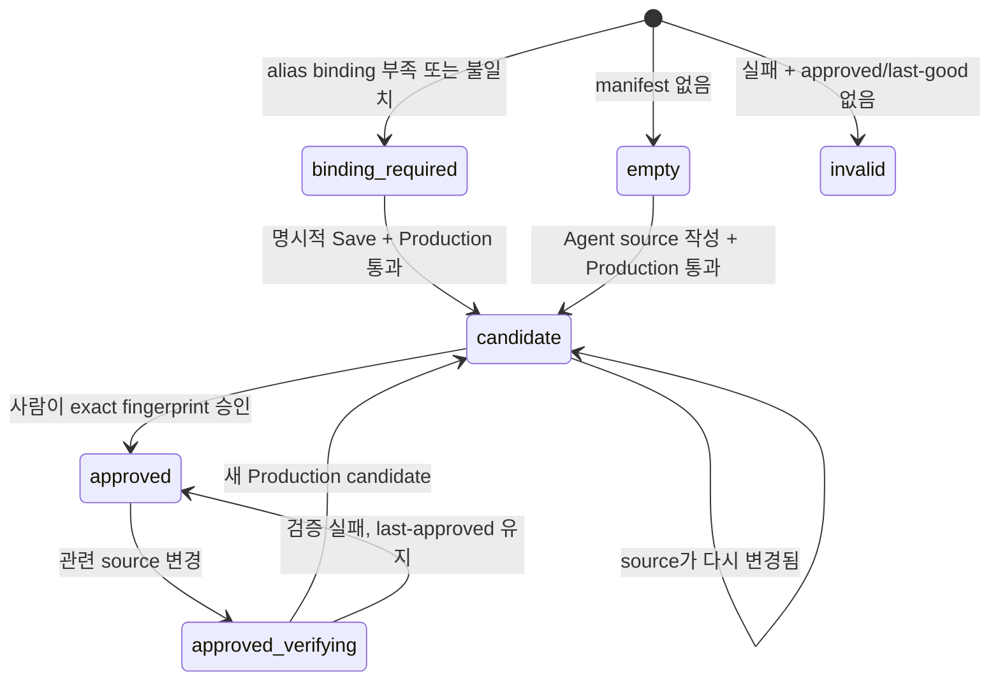

# Project Map 계약

> 문서 상태: **활성 규범 계약**
>
> 범위: repository-owned Architecture/Workflow/Sequence/Dataflow/Lifecycle 원본, 검증,
> canonical scene, 승인, export, native desktop reader와 human-led Agent authoring.

## 1. 제품 의도와 연구 경계

Project Map은 예쁜 그림 생성기가 아니라 현재 checkout의 구현 주장을 source line과 함께
다시 검증할 수 있는 개발자용 시스템 지도다. 사용자는 같은 collection 안에서 여러 관점을
선택하고, stable semantic ID로 검색·focus·경로 탐색하며, 각 주장과 관계의 근거로 이동한다.

설계 연구 기준은 Archify **v2.15.0**, commit
[`e1ac748f19cf805e44bf74fb93c796662152e273`](https://github.com/tt-a1i/archify/tree/e1ac748f19cf805e44bf74fb93c796662152e273)다.
참고한 것은 typed mode, stable identity, 검증 가능한 delivery, 사람의 visual review 원칙이다.
Archify의 source, schema, renderer, CLI, HTML/CSS/template, runtime, asset, package와 생성물을
복사·vendoring·호출하지 않는다. EZTerminal의 repository contract와 native runtime이 유일한
제품 권한이며 외부 프로젝트의 변경으로 자동 갱신되지 않는다.

## 2. 권한과 쓰기 경계

| 데이터 | 권위 원천 | 쓰기 권한 |
| --- | --- | --- |
| manifest와 map JSON | owner repository의 `.ezterminal/project-map/` | 사람 또는 사람이 선택한 Agent |
| logical root alias | manifest | repository author |
| alias와 Project root/workspace binding | desktop app-data | 사용자의 명시적 Save |
| schema와 semantic validation | [`project-map.ts`](../../src/shared/project-map.ts) | 제품 코드 |
| 좌표·route·label placement를 포함한 canonical scene | [`project-map-layout.ts`](../../src/shared/project-map-layout.ts) | 제품 코드 |
| source read, digest, provenance, watcher | main `ProjectMapService` | 제품 runtime |
| Production last-good cache | desktop app-data content-addressed cache | main만 |
| 승인 fingerprint | desktop app-data approval store | 사용자의 Approve action을 받은 main만 |
| authoring job | desktop app-data job store | main과 해당 activity capability |
| SVG·PNG·verification receipt | 사용자가 선택한 export directory | 승인된 fingerprint에 대한 명시적 Export |
| camera·검색·선택·탐색 상태 | renderer memory | 사용자 interaction |

EZTerminal은 `.ezterminal/project-map/`의 권위 원본을 만들거나 수정하지 않는다. Agent에게
사용자가 검토한 brief를 전달할 뿐이며, app이 쓸 수 있는 repository 밖의 결과는 사용자가
명시적으로 선택한 export directory뿐이다. export 대상이 권위 디렉터리 내부이면 거부한다.

Repository source에는 machine-local `rootId`, `workspaceId`, 절대 경로가 없다. 여러 checkout은
portable alias를 공유하고 각 desktop에서 alias를 명시적으로 bind한다. `ownerRootAlias`는
요청의 owner root/workspace와 일치해야 하며 모든 bound root는 해당 workspace의 Git
top-level이어야 한다.

## 3. Repository source contract

```text
.ezterminal/project-map/
├── manifest.json
└── maps/
    └── <map-id>.<type>.json
```

manifest와 map은 `schemaVersion: 2` strict JSON이다. v1 read compatibility나 암묵적 migration은
없으며 지원하지 않는 버전은 `schema.unsupported-version`으로 명확히 실패한다. 알려지지 않은
field를 보존하거나 자동 보정하지 않는다. ID는 lowercase kebab-case, path는 POSIX 상대
경로만 허용한다. drive prefix, 절대 경로, `..`, backslash, remote URL, HTML/CSS/script,
executable payload와 app-local identity는 금지한다.

각 map은 생성 시점에 authored prose의 `contentLocale`을 고정한다. 기존 map을 UI locale에
따라 자동 번역하지 않으며 English identifier와 stable ID는 그대로 유지한다. Agent가 소유할
수 있는 layout 정보는 `layoutIntent.density`와 stable `emphasisIds`, mode별 group/lane/stage/
phase, rank/order와 authored path뿐이다. pixel coordinate와 route는 canonical engine만 소유한다.

Manifest entry는 `id`, `type`, map-relative `path`, 하나 이상의 `authoritativeInputs`, `review`를
가진다. review decision은 `map-updated` 또는 구체적 reason을 가진 `no-semantic-impact`다.
manifest identity와 map의 `id/type`이 다르면 실패한다.

| mode | 필수 의미 구조 |
| --- | --- |
| `architecture` | ownership/dependency boundary, group, ranked node, explicit relation, connected `mainPath` |
| `workflow` | human/system decision ownership, lane, action/decision/review/result, transition, connected `mainPath` |
| `sequence` | time-ordered participant와 call/return/event/error message |
| `dataflow` | data shape/movement/transformation, stage, entity, flow, connected `primaryPath` |
| `lifecycle` | phase, initial state, recovery/terminal state와 event-labelled transition |

모든 semantic item과 relation/message/transition은 하나 이상의 evidence anchor를 가진다.
chapter는 stable ID의 authored focus 묶음이며 runtime이 새 의미나 경로를 추론하지 않는다.

## 4. Evidence, review digest와 provenance

Evidence anchor는 `rootAlias`, `relativePath`, inclusive `startLine/endLine`, `lineDigest`, 사람이
읽을 수 있는 `claim`으로 구성된다. Main은 bound workspace API로 파일을 읽고 CRLF/CR을 LF로
정규화한 뒤 지정된 줄만 LF로 연결한다. 끝에 newline을 덧붙이지 않은 UTF-8 bytes의 SHA-256을
`sha256:<hex>`로 비교한다. 범위가 파일 밖이거나 digest가 다르면 current source는 invalid다.

Authoritative input digest는 각 파일의 exact byte SHA-256인 `fileVersion`을 사용한다. record를
`rootAlias`, `relativePath` 순으로 정렬하고 각각
`rootAlias + NUL + relativePath + NUL + fileVersion`으로 만든 뒤 LF로 연결한 UTF-8 bytes를
SHA-256한다. 이 값이 `review.inputDigest`와 다르면 map은 `stale`이며 Production cache와 승인을
통과하지 못한다.

각 bound root에서 map 관련 path만 `git status --porcelain -z -- <paths>`로 확인한다. 관련 변경이
없으면 HEAD commit-pinned provenance, 있으면 HEAD·status·관련 file version을 묶은 worktree
snapshot을 기록한다. repository 전체가 dirty라는 이유만으로 map을 dirty로 만들지 않는다.
Git top-level, HEAD 또는 관련 status를 확정할 수 없으면 fail closed다.

## 5. Canonical scene와 검증 profile

Schema v2 semantic source에서 하나의 deterministic `ProjectMapScene`을 만든다. Native reader,
standalone SVG와 PNG는 모두 이 scene의 node bounds, wrapped labels, bands/lifelines, obstacle-aware
routes와 label positions를 소비한다. renderer나 exporter가 별도 geometry를 재계산하지 않는다.

`Draft`와 `Production`은 CLI/API의 명시적 quality profile이다. Agent는 Draft로 빠르게 반복한 뒤
Production을 실행한다. Production document는 다음 열 개의 named check가 모두 `passed`이고
diagnostic이 하나도 없으며 stale하지 않을 때만 cache와 승인 후보가 된다.

`schema`, `semantics`, `evidence`, `inputs`, `layout`, `routes`, `labels`, `containment`,
`accessibility`, `provenance`.

각 map fingerprint는 quality gate version, 해당 manifest entry, spec/input/layout hash, binding과
관련 provenance로 만든다. 다른 map의 변경은 fingerprint를 오염시키지 않는다. Watcher는
manifest, map source와 input/evidence의 reverse index로 impacted map ID만 debounce해 알린다.

## 6. 표시 상태, candidate와 승인



승인은 map ID와 exact Production fingerprint에 잠긴다. Candidate preview는 허용하지만 승인 전
기본 export는 잠긴다. 기존 승인이 있으면 app은 in-memory/disk cache에서 last-approved를 즉시
보여 주고 Production 검증을 background single-flight로 수행한다. current source가 invalid여도
검증되지 않은 JSON/geometry를 그리지 않는다.

Approved와 candidate가 다르면 stable semantic ID 기준으로 semantic field change와 evidence
anchor change를 분리해 보여 준다. 제품은 risk를 추론하거나 자동 번역하지 않는다. 새 승인을
누르면 main이 source를 다시 Production 검증하고 fingerprint, valid state, 열 개 check와 zero
diagnostic을 재확인한 뒤 approval store를 갱신한다.

## 7. Authoring job와 Agent protocol

Empty state의 **Project Map 만들기**와 기존 map의 authoring details는 설정된 Codex/Claude
launcher, map type과 editable brief를 보여 준다. 사용자가 실행하기 전에는 아무것도 전달하지
않는다. 실행하면 owning project/root/workspace를 검증한 뒤 일반 `새 세션` 경로로 전용 Agent
tab을 열며, 기존 active Agent나 coordination 참여 여부에는 의존하지 않는다.

전용 terminal의 실제 `sessionId + provider`에 해당하는 activity가 확인된 뒤 persisted job을
만들고 같은 PTY에 prompt를 한 번 제출한다. 기존 Agent의 `whenReady` queue로 우회하지 않는다.
Phase는 다음 순서를 갖는다.

`queued → analyzing → authoring → validating-draft → validating-production → awaiting-review → completed`

`failed`, `cancel-requested`, `canceled`는 명시적 실패/협력 취소 상태다. PTY 제출이 실패하면
막 생성한 job을 즉시 취소하며 같은 전용 tab에서 재시도할 수 있다. 해당 Agent가 취소 요청을
받으면 `canceled` 또는 `failed`로 응답해야 한다. Job은 해당 activity ID만 capability-scoped
`ezterminal-agent map job <job-id> <phase>`로 갱신한다. App은 human approval 뒤에만
`awaiting-review`를 `completed`로 바꾼다.

Agent는 `ezterminal-agent map guide <type>`, `map check [map-id] --quality draft|production`을
사용한다. Native shim은 system Node runtime에 의존하지 않으며 loopback server는 source
activity의 main-resolved project/root/workspace만 읽는다. 앱은 성공을 가장하거나 commit/merge를
시작하지 않는다.

## 8. Native reader와 접근성

Project Explorer의 Map action은 collection당 하나의 Dockview panel을 재사용한다. Reader는
native React/SVG이며 외부 HTML, WebContentsView, repository CSS나 실행 가능한 내용을 렌더링하지
않는다. Pan/zoom/Fit, minimap, search, authored chapter와 main path, upstream/downstream,
stable-ID relation focus, semantic outline과 evidence inspector를 제공한다.

넓은 panel은 rail, diagram, inspector를 나란히 둔다. 좁은 panel은 선택된 inspector를 아래로
보내되 선택 항목이 없으면 verification summary만 남겨 diagram 높이를 보존한다. Resize는
camera만 바꾸며 map을 remount하지 않는다. SVG item과 relation은 keyboard focus와 accessible
name을 가지고 동일 내용을 탐색하는 semantic outline이 있다. 상태와 check는 색만으로 전달하지
않고 `prefers-reduced-motion`에서 기능 손실 없이 즉시 전환한다. UI flow·responsive·localization
계약은 [`frontend-design.md`](../ux/frontend-design.md)가 소유한다.

## 9. Export 계약

Export는 승인 fingerprint와 map ID를 main에서 다시 조회한다. Theme은 current/light/dark 중
명시적으로 선택한다. Canonical scene으로 standalone SVG를 직렬화하고 JavaScript·Node가 꺼진
sandboxed hidden BrowserWindow에서 정확히 1600×900 PNG를 캡처한다.

결과는 `<map-id>-<short-fingerprint>` 새 디렉터리에 `<map-id>.svg`, `<map-id>.png`,
`<map-id>.verification.json`으로 stage한 뒤 atomic rename한다. 기존 destination은 덮어쓰지 않는다.
Receipt에는 viewport, theme, palette hash, artifact hash, verification과 provenance를 기록한다.

## 10. 성능과 변경 절차

Warm approved/cache display는 p95 250ms 이내, Production validation은 p95 2초 이내가 release
기준이다. `pnpm project-map:profile`은 warmup 뒤 각각 30회를 측정해
`out/project-map-profile.json`에 p50/p95/max와 호출 수를 남긴다. 이 전용 측정은 일반 release
performance benchmark와 별개다.

변경 순서:

1. Manifest, impacted map, authoritative inputs와 모든 evidence range를 읽는다.
2. 실제 의미가 바뀌면 claim/identity/anchor를 함께 갱신한다.
3. 각 line digest와 전체 input digest를 재계산한다.
4. `map-updated`, 또는 구체적 reason을 가진 `no-semantic-impact`를 기록한다.
5. `pnpm project-map:check`, 관련 unit/component/Storybook/visual, `pnpm project-map:profile`, ordinary
   `pnpm e2e`를 통과한다.
6. 사람이 candidate diff와 snapshot을 검토하고 map 승인, commit 또는 merge를 각각 결정한다.

## 근거 소스

- [`src/shared/project-map.ts`](../../src/shared/project-map.ts)
- [`src/shared/project-map-layout.ts`](../../src/shared/project-map-layout.ts)
- [`src/shared/project-map-scene.ts`](../../src/shared/project-map-scene.ts)
- [`src/main/project-map-service.ts`](../../src/main/project-map-service.ts)
- [`src/main/project-map-cache-store.ts`](../../src/main/project-map-cache-store.ts)
- [`src/main/project-map-approval-store.ts`](../../src/main/project-map-approval-store.ts)
- [`src/main/project-map-job-store.ts`](../../src/main/project-map-job-store.ts)
- [`src/main/project-map-exporter.ts`](../../src/main/project-map-exporter.ts)
- [`src/renderer/ProjectMapPanel.tsx`](../../src/renderer/ProjectMapPanel.tsx)
- [`.ezterminal/project-map/manifest.json`](../../.ezterminal/project-map/manifest.json)
- [`scripts/check-project-maps.mjs`](../../scripts/check-project-maps.mjs)
- [`scripts/profile-project-map.mjs`](../../scripts/profile-project-map.mjs)

## 검증

주요 자동 검증은 [`scripts/check-project-maps.mjs`](../../scripts/check-project-maps.mjs)의 source/evidence
계약, shared schema/scene, service/cache/approval/job, Agent control, renderer component,
Storybook/axe/visual matrix와 packaged export path를 포함한다. Project Map 전용 p95 계약은
[`scripts/profile-project-map.mjs`](../../scripts/profile-project-map.mjs)가 측정하고 보고서를 남긴다.
